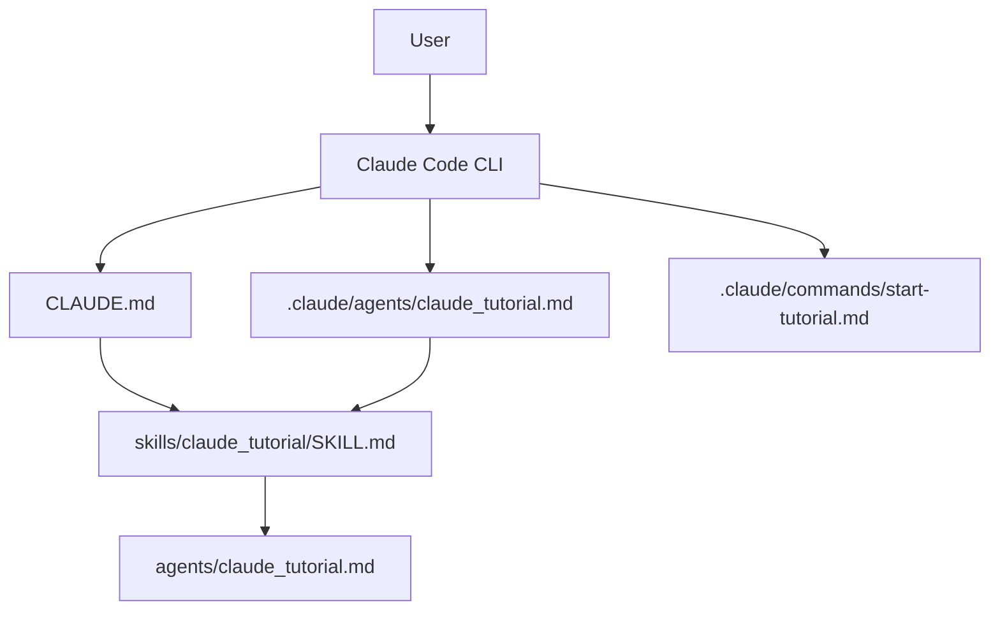

# claude_tutorial

Learn Claude Code by doing, not by reading long docs.

This repo packages a friendly terminal tutor for absolute beginners. It teaches Claude Code through two tracks:

- Developer: commands, file references, memory, permissions, MCP, subagents
- Non-Developer: writing, task planning, understanding code, summaries

## What This Repo Is

This is not an application with runtime code. It is a prompt-driven tutorial project for Claude Code.

The main repo entry points are:

- `CLAUDE.md`: project instructions Claude Code auto-loads when launched in this repo
- `.claude/agents/claude_tutorial.md`: project subagent for the tutorial persona
- `.claude/commands/start-tutorial.md`: optional project slash command to start the tutorial
- `skills/claude_tutorial/SKILL.md`: canonical lesson content and tutorial rules
- `agents/claude_tutorial.agent.md`: reference agent prompt
- `agents/claude_tutorial.md`: product/design doc

## Prerequisites

- Claude Code installed
- Anthropic account / Claude subscription or console access

If `claude` is not on your `PATH`, launch it directly with your local binary:

```bash
/Users/chiragshah/Library/pnpm/claude
```

Anthropic’s official docs describe Claude Code as a terminal coding agent that can edit files, run commands, use MCP, and load project instructions from `CLAUDE.md`.

Sources:
- https://docs.anthropic.com/en/docs/claude-code/overview
- https://docs.anthropic.com/en/docs/claude-code/slash-commands
- https://docs.anthropic.com/en/docs/claude-code/memory
- https://docs.anthropic.com/en/docs/claude-code/sub-agents

## Quick Start

```bash
git clone https://github.com/chiggly007/claude_tutorial.git
cd claude_tutorial
/Users/chiragshah/Library/pnpm/claude
```

Then inside Claude Code, either:

- type `start tutorial`
- run `/start-tutorial`
- ask a direct question like `what does /permissions do?`

If you also want this installed as a local Codex skill, keep the flat install at:

- `~/.codex/skills/claude_tutorial/SKILL.md`
- `~/.codex/skills/claude_tutorial/catalog.yml`

## Tutorial Flow

The tutor starts by asking which track fits you:

- Developer
- Non-Developer

Shared lessons:

- `S1` Welcome and verify setup
- `S2` First prompt
- `S3` Permission model

Developer lessons:

- `D1` Slash commands and modes
- `D2` File references with `@`
- `D3` Planning with Plan Mode
- `D4` Memory and project instructions
- `D5` Advanced: MCP, subagents, custom commands

Non-Developer lessons:

- `N1` Writing and editing
- `N2` Task planning
- `N3` Understanding code without writing it
- `N4` Summaries and extraction

## Claude Code Features This Repo Teaches

- `/help` for built-in and project commands
- `/clear` and `/compact`
- `/doctor` for installation health checks
- `/model`
- `/permissions`
- `/memory` and `CLAUDE.md`
- `/mcp`
- `/agents`
- `/review`
- Plan Mode via permission mode / `Shift+Tab`
- Project commands in `.claude/commands/`
- Project subagents in `.claude/agents/`

## Architecture



## Project Structure

```text
claude_tutorial/
├── CLAUDE.md
├── .claude/
│   ├── agents/
│   │   └── claude_tutorial.md
│   └── commands/
│       └── start-tutorial.md
├── agents/
│   ├── claude_tutorial.agent.md
│   └── claude_tutorial.md
├── skills/
│   └── claude_tutorial/
│       ├── SKILL.md
│       └── catalog.yml
├── AGENTS.md
├── CONTRIBUTING.md
├── TESTING.md
└── SECURITY.md
```

## Troubleshooting

If Claude Code does not start:

- run `/Users/chiragshah/Library/pnpm/claude` directly
- run `/doctor` inside Claude Code
- if needed, sign in with `/login`

If project instructions are not being used:

- make sure you launched Claude Code from the repo root
- confirm `CLAUDE.md` exists in the current directory
- run `/help` and verify `/start-tutorial` appears as a project command

If `@` references do not autocomplete:

- make sure you are inside a directory with files
- use an explicit path like `@README.md` or `@./agents/claude_tutorial.md`

## Testing

See `TESTING.md` for conversation playbooks. This repo is tested through scripted interactions, not unit tests.
